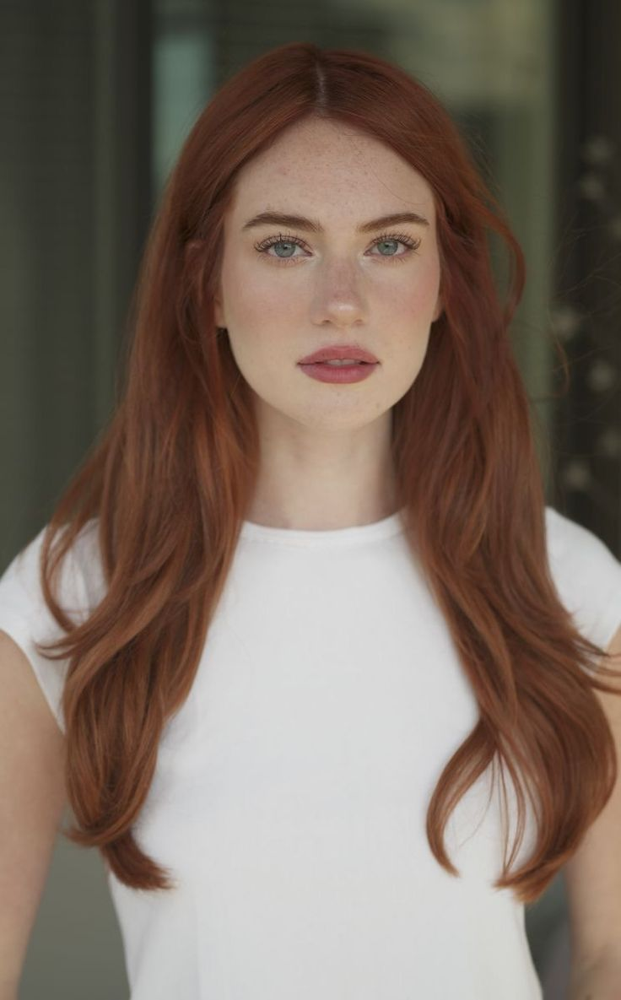

# Proyecto Storytelling: 
### my_storytelling

Autores:  
<!---
Incluir lista de personas del grupo 
Se puede añadir enlace a página personal de github o lo que se quiera...(optativo)
-->

- :woman: lunaramosleon
- :woman:luciasalg
- :woman: ElenaDelPueblo03

Proyecto (código): 

Tipo/Género:  
- [ ] FictionCiberpunk  
- [ ] Reality/tribus urbanas  
- [x] Comic

## Resumen

### ROSE

  Formato cómic 

Rose tiene 30 años, sus padres murieron en un accidente cuando tenía 10 años. Tuvo que cuidar de si misma joven porque no tenía más familiares. Su único familiar era su abuelo y no tenía relación ninguna con él. Únicamente sabía que vivía al norte de Los Ángeles. Ella se dedica desde joven al periodismo, siempre le ha encantado la documentación viajar y la historia. Tiene una personalidad curiosa, audaz, ingeniosa, y magnética. 
 

### Historia
Una mujer llamada Rose hereda un terreno en la huerta de su abuelo, un familiar para ella desconocido, y decide crear una granja. Necesita un tiempo de desconexión en su vida así que decide mudarse allí al menos durante un tiempo. Meses después comienza a sentirse observada. Un hombre la está vigilando, quiere hacerse con su propiedad porque hay algo escondido. Ella tiene lidiar entre su gran deseo de justicia y sobrevivir para que no la maten. 

### Contexto
Nos encontramos en 1978 en una granja en mitad de Agoura Hills una ciudad ubicada en el noroeste del condado de Los Ángeles, en California. 

### Conflicto 
La protagonista tiene un gran deseo de justicia y de protección de su legado. Aún así se arriesga a que en el intento de descubrir la verdad y proteger su legado puedan matarla o hacerle daño.

### Productos

- Personajes:   Formato real

JACK  
  

- Banner/Teaser: [Ver video](https://youtu.be/L1FY5TMMoas)

- Storytelling: Herencia oscura, secretos profundos. ¿Qué oculta la casa desconocida?

Enlace al interactivo:https://h5p.org/node/1479678?feed_me=nps

### Conclusiones/Valoración del equipo
Esta historia combina suspense, tensión e incluso drama. Estamos muy contentas de cómo va cogiendo forma nuestra historia y cada vez nos va gustando más, además estamos orgullosas del trabajo que estamos llevando acabo en esta asignatura. 

------

<!---
Lista completa de emojis de markDown - https://gist.github.com/rxaviers/7360908) 
-->

Febrero, 202X

Proyecto dentro de la serie [COMAV Stories](https://github.com/mgea/storytelling/blob/master/What_is_a_digital_storytelling.md) 
Proyectos seleccionados de [2023](https://github.com/mgea/storytelling/tree/master/2023), [2022](https://github.com/mgea/storytelling/blob/master/2022/readme.md) / [2021](https://github.com/mgea/storytelling/blob/master/2021/readme.md) / [2020](https://github.com/mgea/storytelling/blob/master/2020/readme.md)  / 
[2019](https://github.com/mgea/storytelling/blob/master/2019/readme.md) / [2018](https://github.com/mgea/storytelling/blob/master/2018/readme.md) 

CC BYNCSA  [Creacion y Difusión de Nuevos Contenidos Audiovisuales](http://utopolis.ugr.es/medialab)
 

[Facultad de Comunicación y Documentación](http://fcd.ugr.es)

Universidad de Granada
